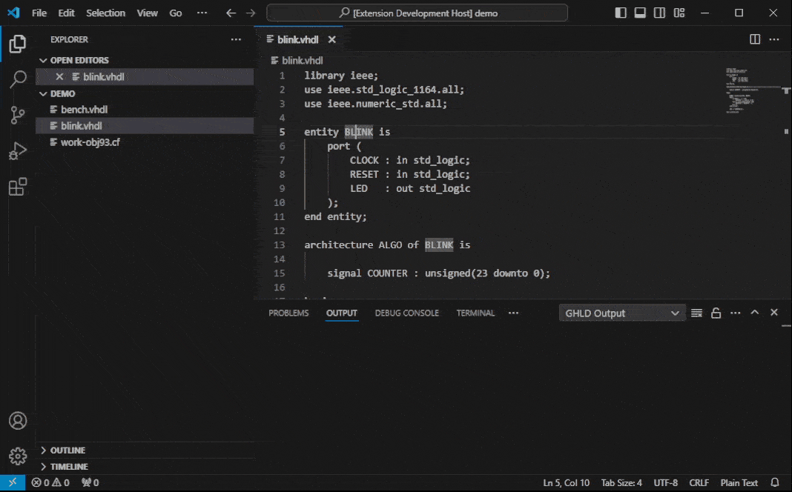

<h1 align="center"> VHDL Wave </h1>
This extension allows you to invoke GHDL functions, as well as GTKWave to perform simlation of VHDL files. Beyond, it lists the errors that were reported by GHDL in the GHDL Output channel. Using <ctrl> key you can click the description of the error location in the log to reach that location and fix your mistake.



## Requirements

You will need to have [GHDL](https://github.com/ghdl/ghdl/releases) and [GTKWave](http://gtkwave.sourceforge.net/) installed on your system. Furthermore both must be set in your environment variables.

## Usage

### GHDL

At present it is possible to invoke the following GHDL functions by either right-clicking at the editor or at the explorer on the specific file and then selecting the desired funtion.

| Editor Option  | GHDL Function                  |
| -------------- | :----------------------------- |
| ghdl analyze   | `ghdl -a [File]`               |
| ghdl elaborate | `ghdl -e [Unit]`               |
| ghdl run       | `ghdl -r [Unit] [export file]` |
| ghdl make      | `ghdl -m [unit]` (+ run if OK) |
| ghdl remove    | `ghdl --remove`                |

In addition to that the GHDL analyze function offers you error highlighting in the editor.

### GTKWave

To open your simulation files with GTKWave, simply rightclick on them (.ghw or .vcd file required) in the explorer and then select `gtkwave`

## VHDL-LS _(new in V1.3.0)_

VHDL-Wave recommends VHDL-LS for syntax, and syntax error highlighting. VHDL-Wave automatically generates the configuration file that VHDL-LS needs to
find all references. This feature can be disabled in setting (see `vhdl-wave > General: Enable Ls Toml`).

It is still possible to complement the generated `vhdl-ls.toml` file with additional data. This must be done below the limit indicated in the file.

## Keybindings

It is also possible to invoke the GHDL functions via the following keybindings.

| Editor Option  | Windows          | Linux             | MacOS             |
| -------------- | :--------------- | :---------------- | :---------------- |
| ghdl analyze   | `ctrl + alt + a` | `shift + alt + a` | `shift + cmd + a` |
| ghdl elaborate | `ctrl + alt + l` | `shift + alt + e` | `shift + cmd + e` |
| ghdl run       | `ctrl + alt + r` | `shift + alt + r` | `shift + cmd + r` |
| ghdl make      | `ctrl + alt + m` | `shift + alt + m` | `shift + cmd + m` |
| ghdl remove    | `ctrl + alt + d` | `shift + alt + d` | `shift + cmd + d` |

## VHDL-LS _(new in V1.3.0)_

VHDL-Wave recommends VHDL-LS for syntax highlighting. VHDL-Wave automatically generates the configuration file that VHDL-LS needs to
find all references. This feature can be disabled in setting (see `vhdl-wave > General: Enable Ls Toml`).

It is still possible to complement the generated `vhdl-ls.toml` file with additional data. This must be done below the limit indicated in the file.

When a library is added to the configuration (setting `Library Directories`) this directory is searched for files following library naming rule:

`<library-name>_obj<vhdl-version>.cf`

These library files are then parsed to find the corresponding source files which are then added to `vhdl-ls.toml` file.

## `vhdl-wave.json` file _(new in V1.3.0)_

The file `.vscode/vhdl-wave.json` in the workspace folder allows overriding the following settings: `Work Library Name` and `Work Library Path`.

The aim is to allow switching easily between library development and main application development.

The standard development takes place in the `work` library which is the default _VHDL-Wave_ setting. But when you develop a library you must name the working library with the target library name. And you may want to place it in a particular place where you locate your libraries.

By defining specific library name and location in `vhdl-wave.json` file of the library development folder you will allow to use the right parameters as soon you enter the library development folder with vscode.

The typical content of `vhdl-wave.json` file to develop a library `myCustomLibrary` is:

```JSON
{ 
    "WorkLibraryPath": "/mylibrary/rootpath/" ,
    "WorkLibraryName": "myCustomLibrary"
}
```

## Contributions

In case you encounter any problems or have suggestions regarding the extension, feel free to open an issue at first.

## License

The extension is [licensed](LICENSE "license") under the MIT license.

